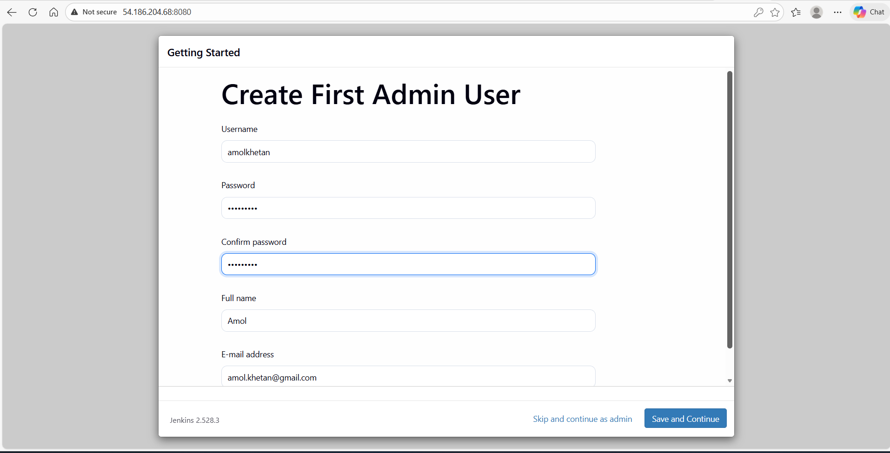
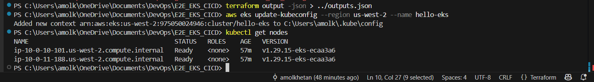
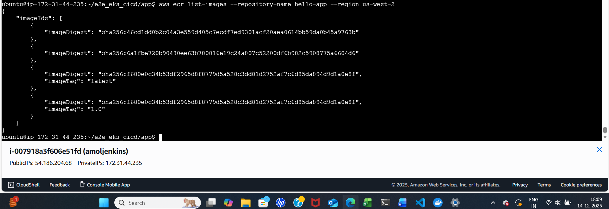
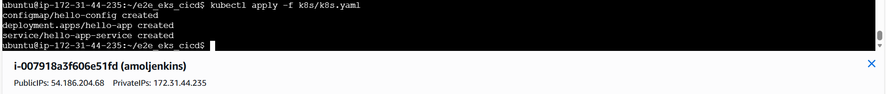
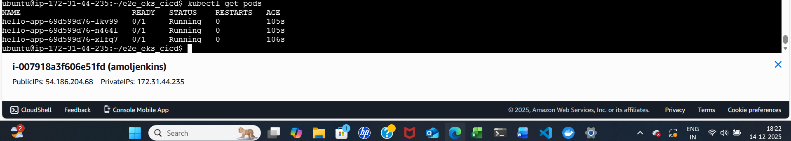
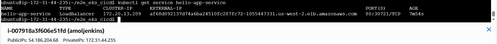

# E2E_EKS_CICD
End-to-end EKS CI/CD Projectto deploy a Flask application to AWS EKS using Terraform and Jenkins.

## 📋 Architecture

```
GitHub → Jenkins → Docker → AWS ECR → EKS Cluster → LoadBalancer
```

## 🚀 Quick Start (Total: 2-3 hours)

### Prerequisites
- AWS Account (ID: 975050024946)
- AWS CLI configured
- GitHub account
- SSH key pair in AWS (us-west-2)

---

## 📝 Step-by-Step Implementation

### **STEP 1: Launch Jenkins EC2** (10 mins)

```bash
# 1. Launch EC2 instance
# Go to AWS Console → EC2 → Launch Instance

# Configuration:
# - Name: amoljenkins
# - AMI: Ubuntu 22.04 LTS
# - Instance type: t2.medium
# - Key pair: Your existing key
# - Security Group:
#   * Port 22 (SSH) - Your IP
#   * Port 8080 (Jenkins) - Your IP
# - Storage: 20 GB gp3

# 2. SSH into instance
ssh -i your-key.pem ubuntu@<EC2_PUBLIC_IP>

# 3. Clone your repo
git clone https://github.com/amolkhetan/e2e_eks_cicd.git
cd e2e_eks_cicd

# 4. Run Jenkins setup
chmod +x scripts/jenkins_setup.sh
./scripts/jenkins_setup.sh

# 5 Jenkins password will be there at below location
/var/lib/jenkins/secrets/initialAdminPassword




# This takes ~15 minutes. Note the initial admin password!
```

---

### **STEP 2: Deploy AWS Infrastructure** (20 mins)

```bash
# On your LOCAL machine/laptop

cd terraform

# Initialize Terraform
terraform init

# Review plan
terraform plan

# Deploy (takes ~15 minutes)
terraform apply -auto-approve

# Save outputs
terraform output -json > ../outputs.json

# Configure kubectl locally
aws eks update-kubeconfig --region us-west-2 --name hello-eks

# Verify cluster
kubectl get nodes



```

**Expected output:**
```
NAME                          STATUS   ROLES    AGE   VERSION
ip-10-0-10-xxx.ec2.internal   Ready    <none>   2m    v1.28.x
ip-10-0-11-xxx.ec2.internal   Ready    <none>   2m    v1.28.x
```

---

### **STEP 3: Configure Jenkins** (20 mins)

```bash
# 1. Open Jenkins in browser
http://<JENKINS_PUBLIC_IP>:8080

# 2. Enter initial admin password (from setup script)

# 3. Install suggested plugins (takes ~5 mins)

# 4. Create admin user
# Username: admin
# Password: <your-choice>


# 5. Create new Pipeline job
# - Click "New Item"
# - Name: eks-pipeline
# - Type: Pipeline
# - Click OK

# 6. Configure Pipeline
# Scroll to "Pipeline" section:
# - Definition: Pipeline script from SCM
# - SCM: Git
# - Repository URL: https://github.com/amolkhetan/e2e_eks_cicd.git
# - Branch: */main
# - Script Path: Jenkinsfile

# 7. Save
```

---

### **STEP 4: Test Application Locally** (10 mins)

```bash
# On your local machine

cd app

# Install dependencies
pip3 install -r requirements.txt

# Run tests
python3 -m unittest discover -s tests -v

# Run locally
python3 app.py

# Test in browser: http://localhost:5000

# Test endpoints:
curl http://localhost:5000/
curl http://localhost:5000/health
curl http://localhost:5000/api/tasks
```

---

### **STEP 5: Build and Push First Image** (15 mins)

```bash
# Get ECR URL from Terraform output
ECR_REPO=$(terraform output -raw ecr_repository_url)

975050024946.dkr.ecr.us-west-2.amazonaws.com/hello-app

# Login to ECR
aws ecr get-login-password --region us-west-2 | docker login --username AWS --password-stdin 975050024946.dkr.ecr.us-west-2.amazonaws.com

# Build image
sudo docker build -t hello-app:1.0 .

# Tag for ECR
sudo docker tag hello-app:1.0 $ECR_REPO:1.0
sudo docker tag hello-app:1.0 $ECR_REPO:latest

sudo usermod -aG docker $USER
newgrp docker

# Push to ECR
sudo docker push $ECR_REPO:1.0
sudo docker push $ECR_REPO:latest

# Verify
aws ecr list-images --repository-name hello-app --region us-west-2


```

---

### **STEP 6: Deploy to Kubernetes** (10 mins)

```bash
# Apply Kubernetes manifests
kubectl apply -f k8s/k8s.yaml



# Watch deployment
kubectl get pods -w



# Check all resources
kubectl get all

# Get LoadBalancer URL (takes 2-3 mins to provision)
kubectl get service hello-app-service




# Copy EXTERNAL-IP and test
LB_URL=$(kubectl get service hello-app-service -o jsonpath='{.status.loadBalancer.ingress[0].hostname}')

# Test application
curl http://$LB_URL/

```

---

### **STEP 7: Run CI/CD Pipeline** (15 mins)

```bash
# 1. Make a code change
# Edit app/app.py - change version or add a task

# 2. Commit and push
git add .
git commit -m "Update app version"
git push origin main

# 3. Trigger Jenkins build
# Go to Jenkins → flask-eks-pipeline → "Build Now"

# 4. Watch pipeline execution
# Click on build number → Console Output

# 5. Verify deployment
kubectl get pods
kubectl describe deployment flask-app

# 6. Test updated application
curl http://$LB_URL/version
```

---

### **STEP 8: Take Screenshots** (10 mins)

**Take screenshots of:**

1. ✅ **Terraform Apply Output**
   ```bash
   terraform output
   ```

2. ✅ **EKS Cluster in AWS Console**
   - Go to AWS Console → EKS → Clusters

3. ✅ **ECR Repository with Images**
   - AWS Console → ECR → Repositories

4. ✅ **Jenkins Pipeline Success**
   - Jenkins Dashboard showing green build

5. ✅ **Kubernetes Resources**
   ```bash
   kubectl get all -o wide
   ```

6. ✅ **Application Running**
   - Browser showing LoadBalancer URL
   - Postman/curl showing API responses

7. ✅ **Application Endpoints**
   ```bash
   # Home
   curl http://$LB_URL/ | jq

   # Health
   curl http://$LB_URL/health | jq

   # Tasks API
   curl http://$LB_URL/api/tasks | jq
   ```

---

### **STEP 9: Destroy Everything** (10 mins)

```bash
# 1. Delete Kubernetes resources
kubectl delete -f k8s/deployment.yaml

# Wait for LoadBalancer to be deleted (check AWS Console)
# This is IMPORTANT - prevents Terraform errors

# 2. Destroy Terraform infrastructure
cd terraform
terraform destroy -auto-approve

# This takes ~15 minutes

# 3. Terminate Jenkins EC2
# AWS Console → EC2 → Instances → Terminate

# 4. Verify nothing is left
# Check: EKS, ECR, VPC, LoadBalancers, NAT Gateways
```

---

## 💰 Cost Breakdown (for 3 days)

| Resource | Daily Cost | 3-Day Total |
|----------|------------|-------------|
| EKS Control Plane | $2.40 | $7.20 |
| 2x t3.medium Spot | $1.00 | $3.00 |
| NAT Gateways (2x) | $0.90 | $2.70 |
| Jenkins EC2 | $0.80 | $2.40 |
| LoadBalancer | $0.60 | $1.80 |
| **TOTAL** | **~$5.70** | **~$17.10** |

---

## 🔧 Troubleshooting

### Jenkins can't access ECR
```bash
# On Jenkins server
sudo su - jenkins
aws configure
# Enter your AWS credentials
```

### Pods not starting
```bash
# Check pod logs
kubectl logs -l app=flask-app

# Check events
kubectl describe pod <pod-name>

# Common issue: ECR access
kubectl get pods
# If ImagePullBackOff, check ECR permissions
```

### LoadBalancer stuck in pending
```bash
# Check AWS Console → EC2 → Load Balancers
# Usually takes 2-3 minutes

# Check service
kubectl describe service flask-app-service
```

### Terraform destroy fails
```bash
# Delete LoadBalancer first
kubectl delete service flask-app-service

# Wait 2 minutes, then:
terraform destroy -auto-approve
```

---

## 📚 Key Concepts Demonstrated

✅ Infrastructure as Code (Terraform)  
✅ Containerization (Docker)  
✅ Container Orchestration (Kubernetes)  
✅ CI/CD Pipeline (Jenkins)  
✅ Cloud Platform (AWS)  
✅ Networking (VPC, Subnets, NAT)  
✅ Security (IAM Roles, Security Groups)  
✅ Monitoring (Health checks, Probes)  
✅ Cost Optimization (Spot Instances)

---

## 🎯 Interview Talking Points

1. **Why Spot Instances?**
   - Cost savings (~70%)
   - Acceptable for non-critical workloads
   - Kubernetes handles node failures gracefully

2. **Why 3 replicas?**
   - High availability
   - Zero-downtime deployments
   - Load distribution

3. **CI/CD Benefits**
   - Automated testing
   - Consistent deployments
   - Fast feedback loop

4. **Security Practices**
   - IAM roles (no hardcoded credentials)
   - Private subnets for nodes
   - Non-root container user
   - Image scanning

---

## 📞 Support

If you encounter issues:
1. Check troubleshooting section
2. Review Jenkins console output
3. Check kubectl logs
4. Verify AWS Console for resource state

---

## 🎉 Success Criteria

✅ Terraform creates all infrastructure  
✅ Jenkins pipeline runs successfully  
✅ Application accessible via LoadBalancer  
✅ API endpoints respond correctly  
✅ Clean teardown with no resources left  
✅ Screenshots captured for portfolio

---

**Project Time:** 2-3 hours  
**Cost:** ~$17 for 3 days  
**Difficulty:** Medium  
**Impact:** High

Screenshot
Local Validation 
Terraform Plan 
Terraform show 
Terraform Output 
k8s get resource 
k8s Deployment 
k8s log 
k8s describe 
k8s describe pod 
k8s execute pod 
Loadbalancer URL 
Test Validation 
Jenkins pipeline 
Post Deployment 